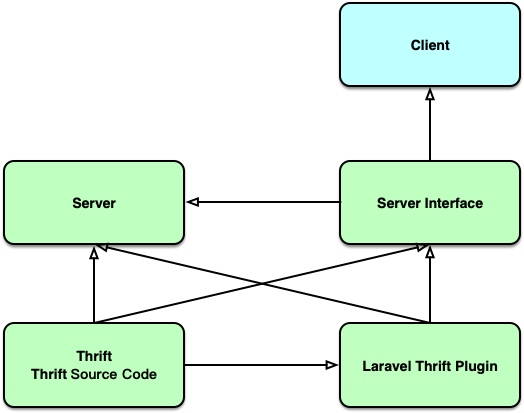

# thrift server

Laravel Thrift 插件

## 如何使用

### 服务端

1. ``composer require lanffy/laravel-thrift-plugin``
2. 在配置``config/app.php->providers``中添加一行:``\Lanffy\Thrift\ThriftServiceProvider::class``
3. 在``app\Http\Kernel``中添加 Middleware ``\Lanffy\Thrift\Middleware\ThriftServerMiddleware::class``,默认会处理``/rpc``上的请求,如果需要更改此规则,请继承此类并覆盖``process``方法
4. 在配置文件``config/thrift.php``中添加配置：
    
    ```php
    return [
       'providers' => [
           [
               'Lanffy.Thrift.Express.HelloService', //thrift中定义的服务名
               ExpressService::class, // 服务实现类
           ],
           [
               'Lanffy.Thrift.Express.CalculateService', //多个服务按数组分开
               CalculateService::class,
           ],
        ],
    ];
    ```

### 客户端

1. ``composer require lanffy/laravel-thrift-plugin``
2. 在配置``app.providers``中添加一行: ``\Lanffy\Thrift\ThriftServiceProvider::class``
3. 在配置文件``config/thrift.php``中,设置`thrift.client`:

    ```php
    return [
        'client' => [
            'http://thrift.server.com/rpc' => [ //服务地址 
                'Lanffy.Thrift.Express.HelloService', //服务1名称
                'Lanffy.Thrift.Express.CalculateService', //服务2名称
            ],
        ],
    ];
    ```
    
4. 使用:
    ```php
        /**
         * A basic test example.
         *
         * @return void
         */
        public function testBasicTest()
        {
            $this->assertTrue(true);
            /**
             * @var $a ThriftClient
             */
            $a = app(ThriftClient::class);
    
            /**
             * @var  $service \Lanffy\Thrift\Express\HelloServiceIf
             */
            $service = $a->with('Lanffy.Thrift.Express.HelloService');
    
            $result = $service->hello('test');
            $this->assertEquals($result, 'testtest');
    
            /**
             * @var  $calculateService \Lanffy\Thrift\Express\CalculateServiceIf
             */
            $calculateService = $a->with('Lanffy.Thrift.Express.CalculateService');
            $res = $calculateService->add(1,2);
            $this->assertEquals($res, 3);
        }
    ```

### 应用依赖



 Inspired by [thrift-laravel](https://github.com/angejia/thrift-laravel)

